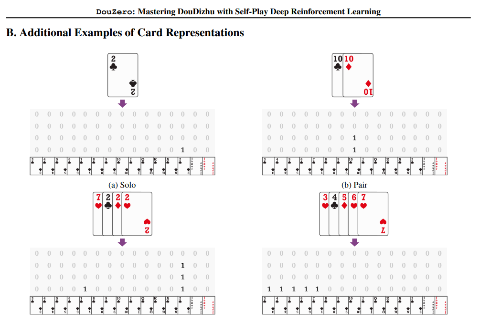
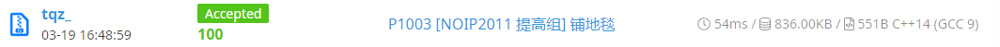
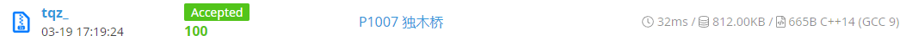
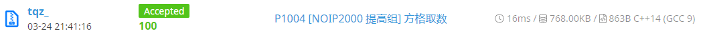
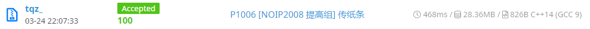
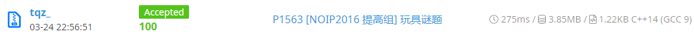

# **英才计划 3月月报**
tqz_ 2023/4/2
## **概要**
本月为正式开始学习的第一个月。在这段时间内，我完成了以下内容：
- 阅读了一篇 *ICML* 论文及其对应源代码
- 阅读了《机器学习》的 1-60 页，同时了解了阅读其内容所需的高等数学知识的基本概念和简单计算
-  *Coding* 能力复健
-  学习了 *Markdown* 的基本语法。
## **论文阅读**
本月阅读的论文来自 *ICML 2021*。标题为 `DouZero: Mastering DouDizhu with Self-Play Deep Reinforcement Learning`
#### 仓库：[github](https://github.com/kwai/DouZero)
Paper：[arXiv](https://arxiv.org/abs/2106.06135)
#### 在阅读论文过程中，我对于此项目的整体结构进行了了解。具体来说：
- 使用了强化学习算法来构建 `Q估值网络` 。对于 *斗地主* 这一纸牌游戏进行了具体分析，分别对`Environment` `Action` `State` `reward`进行具体地表示。
  - **环境** 即斗地主游戏规则本身以及其他二名玩家。在 *training* 的过程中，一个 *actor* 对应的环境包含其余两个 *actor* 进程。
  - **动作** 即每次出牌内容。每个动作都会被编码为一个大小为 `4*15` 的矩阵。
  - **状态** 即当前场上的“局势”，包括`当前手牌` `其他两名玩家的牌的并集` `其他两名玩家的最近一步` `其他两名玩家的剩余牌数` `当前已经打出的炸弹` 以及 `最近15步动作拼接而成的矩阵`。
  - **奖励** 即每次对局从环境中获得的回报。在`WP`算法中，奖励为获胜百分比。在`ADP`算法中，奖励为场均得分的差值。
- 训练时，多线程同时运行，包含多个 `actor` 进程和一个 `learner` 进程。 `actor` 根据当前的模型参数进行出牌，获取其对应 `reward` ，并将动作、状态和奖励信息作为一个条目保存在缓冲区中。每隔一段时间，`learner` 读取缓冲区的条目，调整模型参数。
#### 我注意到， *Douzero* 有一些衍生项目，其中一个项目将 *Douzero* 与图像识别技术结合，实现在游戏“欢乐斗地主”中全自动打牌。我在本地尝试运行了此程序，并观察其出牌行为。发现其已经具有了一般人的水平。但是，尽管取得了不错的表现，在三十余次对局后，此程序仍然将账号上的欢乐豆消耗殆尽。我推测原因如下：
- *欢乐斗地主* 的发牌很有可能并不随机，而是拥有一套算法，根据玩家的胜率和连胜次数来调整下一局游戏中玩家拿到的手牌。根据我的观察，在 *Douzero* 完成3-5次连胜后，往往会拿到更具挑战性的手牌。
- 就如论文中提到的，斗地主游戏的方差较大，运气有时比实力更重要。
- *Douzero* 的算法仍然不够优秀，能力存在上限。也许针对斗地主仍存在着更优的算法。
## **理论学习**
目前阅读了《机器学习》的1-60页，包括*绪论*、*模型评估与选择* 与 *线性模型* 的开头。
在阅读过程中，发现书本内容包含较多的高等数学内容。我在阅读之余简单了解了导数和微积分的基本概念的简单运算。矩阵和概率统计尚待了解。掌握基本概念后，我对于书中出现的公式中的符号意义和推导方向大致了解，但限于时间和数学知识的积累，尚未照书中公式进行仔细推导。
#### 第二章的主要内容是模型的评估与选择。我了解了了评估方法、性能度量、比较检验以及偏差与方差。具体来说：
- 评估方法包括留出法、交叉验证法和自助法。
- 性能度量包括均方误差、错误率、查准率与查全率、*ROC* 与 *AUC*、代价敏感错误率。举例来说，均方误差的公式为：$$E\left(F;D\right)=\frac{1}{m}\int_{x\thicksim D}{\left(f\left(x\right)-y\right)^2p\left(x\right)dx}$$
- 比较检验包括假设检验、交叉验证 *t* 检验、 *McNemar* 检验、 *Friedman* 检验与 *Nemenyi* 检验后溪检验。
- 均差-方差分解可以解释模型的泛化性能。
## **编程能力复健**
本月开始做算法题。简单地重新熟悉了OI题库，然后开始拾起各类算法的知识。目前正在重新熟悉动态规划算法。

    
## **总结**
本月将重心放在了论文和书本的阅读，收获了较多的理论知识。不过项目的源代码和书本的公式推导还有待继续深入理解。
