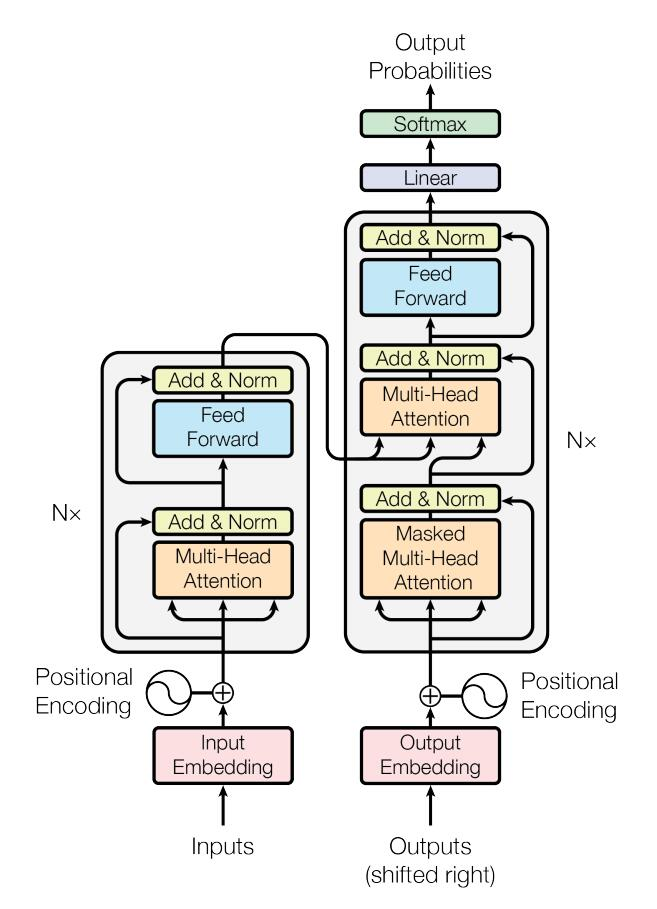
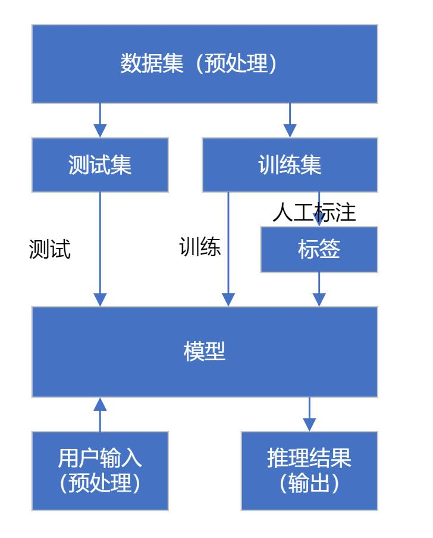
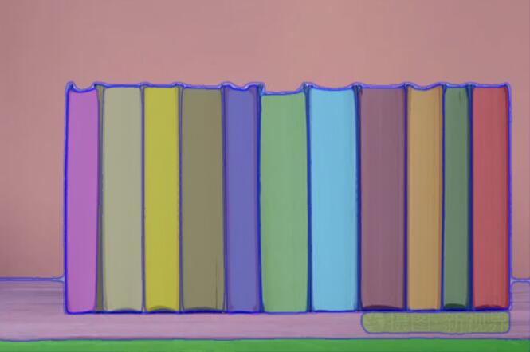
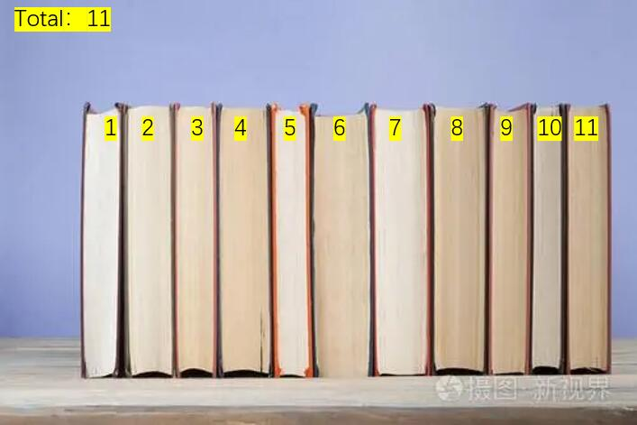

# **英才计划 4月月报**
tqz_ 2023/4/2
## **概要**
在这段时间内，我完成了以下内容：
- 《机器学习》`第三章 线性模型` 和 `第四章 决策树` 的阅读
- 了解了CNN、RNN的基本框架和思路
- 阅读了一篇论文
- 计划了一个项目
## **书本阅读**
这个月完成了《机器学习》`第三章 线性模型` 和 `第四章 决策树` 的阅读。具体来说：
- 线性模型的通式为：
- $$f(\boldsymbol{x}) = w_1x_1+w_2x_2+\ldots+w_dx_d+b$$
一般写成：
$$f(\boldsymbol{x})=\boldsymbol{w}^T\boldsymbol{x}+b$$
线性模型一般包括回归任务、二分类任务和多分类任务。
  - 对于回归任务：
求 
$f(x)$
中的 
$w$
和
$b$
,可以让均方误差最小化，即：
$$(w^*,b^*)=\argmin_{(w,b)}\sum_{i=1}^m(f(x_i)-y_i)^2$$
这个问题可以通过最小二乘法求解。对于线性模型，可以将其进行变化，得到广义线性模型。
  - 对于二分类任务，需要将线性模型的输出值映射到0-1之间，可以使用sigmoid函数，即：
$$\hat{y}=\frac{1}{1+e^{-f(x)}}$$
这种模型被称为对数几率回归模型。要估计模型参数，可以使用极大似然估计法，然后使用梯度下降法求解。此外，还可以使用线性判别分析法。
  - 对于多分类任务，可以利用二分类任务的思想，将多分类任务转化为多个二分类任务，然后使用`OvO` `OvR` `MvM`等方法进行求解。对于`MvM`方法，可以使用 **纠错输出码(ECOC)** 技术。
- 决策树是一种基于树结构进行决策的模型。生成决策树的基本流程遵循"分治思想"。具体来说，就是将数据集分为两个子集，然后对子集进行划分，直到满足某个条件为止。决策树的生成包括决策树的生成和决策树的修剪。
  - 对于特征选择，可以使用信息增益、信息增益比、基尼指数等方法进行选择。信息熵的定义为：
$$Ent(D)=-\sum_{k=1}^{|\mathcal{Y}|}p_k\log_2p_k$$
其中
$p_k$
表示第
$k$
类样本所占的比例。信息增益的定义为：
$$Gain(D,a)=Ent(D)-\sum_{v=1}^V\frac{|D^v|}{|D|}Ent(D^v)$$
其中
$D^v$
表示第
$v$
个子集。信息增益比的定义为：
$$Gainratio(D,a)=\frac{Gain(D,a)}{IV(a)}$$
基尼指数的定义为：
$$Gini(D)=\sum_{k=1}^{|\mathcal{Y}|}\sum_{k'\neq k}p_kp_{k'}=1-\sum_{k=1}^{|\mathcal{Y}|}p_k^2$$
  - 对于剪枝，可以使用预剪枝和后剪枝。预剪枝是指在决策树生成过程中，对每个节点在划分前先进行估计，若当前节点的划分不能带来决策树泛化性能提升，则停止划分并将当前节点标记为叶节点。后剪枝是指先从训练集生成一颗完整的决策树，然后自底向上地对非叶节点进行考察，若将该节点对应的子树替换为叶节点能带来决策树泛化性能提升，则将该子树替换为叶节点。
## **阅读论文**
本月阅读的论文是:`Attention Is All You Need`。  
这篇论文提出了一种新的网络结构`Transformer`，该网络结构完全依赖于attention机制。  
**基本思想**：将输入的序列进行编码，然后使用attention机制进行解码。  
**优点**：可以并行计算，而且可以捕捉到序列中的长距离依赖关系。  
**缺点**：无法捕捉到序列中的位置信息。为了解决这个问题，可以在输入序列中加入位置信息，然后使用位置编码器对输入序列进行编码。该网络结构的具体结构如下图所示：  

## **项目计划**
本月产生了一个做项目的想法，目前还在探索此想法的可能性。    
项目的主题是： `基于图像分割技术和CNN对堆叠的书本进行计数`。    
在图书馆或者学校中，如果需要分发大量书本，人工对其进行计数是一件非常耗时耗力的事情，因此，可以使用计算机视觉技术对其进行计数。  
具体的实现思路是：首先使用图像分割技术分割图片，然后使用CNN判断每个分块是否为书本侧面。  

### **输入内容**
一张图像，内容为一叠书的侧视图，类似于下面这样:  
  
输入图像后，使用[Segment Anything]([https://](https://github.com/facebookresearch/segment-anything))将图像进行分割，分割后的结果如下图所示：  

将每个分块向外拓展一定像素值，然后分别预处理为灰度图像。将每个分块分别使用CNN推测其为书本侧面的置信度，若大于一个阈值，则将其判为一本书。
### **输出内容**
图片中书本总数，以及每本书在图片中的位置。这些内容通过UI标注在原图片上，方便使用者判断识别是否准确。理想的效果如下图所示：  
  
在开发过程中，在保证误判率较低的情况下，需尽可能减小CNN作出正确判断所需要的单个分块最小分辨率，这样能尽可能提高单张图像中能够识别的书本数量，并提升其对于厚度较小的书本的识别准确率。
如果可能的话，为了提升项目的实用性，在demo开发完成后移植到Android平台上，并做性能优化，如手机芯片GPU加速等。此时，输入的图像可由手机相机拍摄，输出的内容可直接显示在手机屏幕上。
## **后续计划**
继续学习理论知识，同时为项目进行规划与准备。
