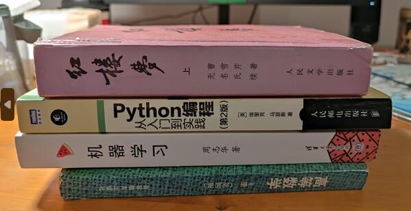
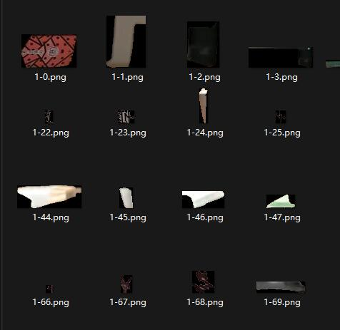

# **英才计划 5月月报**
tqz_ 2023/5/28
## **概要**
在这段时间内，我完成了以下内容：
- 《机器学习》`第五章 神经网络` 的阅读
- 阅读了一篇论文
- 针对上个月提出的项目进行了一部分可行性验证，并修改了计划。
## **书本阅读**
这个月完成了《机器学习》`第五章 神经网络` 。具体来说：
- 神经网络中最基本的成分是 **神经元模型**。
- 对于 **M-P 神经元模型** ，其输出可以表示为：
$$y = f(\sum_{i=1}^{n}w_ix_i-\theta)$$
- 神经元的激活函数常用 **sigmoid 函数** ，其表达式为：
$$f(x) = \frac{1}{1+e^{-x}}$$
- 多层神经网络包含 **输入层** 、**输出层** 和 **隐层** ，其中隐层可以有多个。对于每层神经元与下层神经全互连，神经元之间不存在同层连接，也不存在跨层连接的神经网络，称为 **多层前馈神经网络** 。
- 神经网络的的训练可以通过 **误差逆传播算法 (BP)** 来实现。
- 除了多层神经网络，还有很多种神经网络。如 **RBF网络** 、 **ART网络** 、 **SOM网络** 、 **级联相关网络** 、 **Elman网络** 、 **Boltzmann机** 。
- 对于多隐层神经网络，可以使用 **无监督逐层训练** 的方法进行训练。 
## **阅读论文**
本月阅读的论文是 `AN IMAGE IS WORTH 16X16 WORDS:
TRANSFORMERS FOR IMAGE RECOGNITION AT SCALE` 。  
[Paper](https://arxiv.org/pdf/2010.11929.pdf)  
该论文提出了一种新的图像分类模型 `ViT` ，其使用 `Transformer` 作为基本结构，将图像分割为一系列的 `patch` ，然后将其展平后作为 `Transformer` 的输入。  
ViT 相对于 CNN 的区别在于，CNN 通过卷积操作提取图像的局部特征，而 ViT 通过 `Transformer` 提取图像的全局特征。
ViT在训练集较小时，其表现不如 CNN ，但当训练集较大时，其表现优于 CNN 。
ViT 可以完成图像分类任务，但就现有架构而言，其无法完成目标检测任务。
## **项目计划**
项目的主题是： `基于图像分割技术和CNN对堆叠的书本进行计数`。    
针对此项目，本月进行了一部分可行性验证。我将 **使用SAM进行图像分割** 的步骤进行了代码实现，并对其进行了测试。
代码：
```python
'''

【此文件用于生成数据集。在推测时，也使用此文件进行图像分割】

使用segment anything的方法，对一个文件夹内的所有图片进行分割，将每个分块的图片保存到一个文件夹内
使用方法：python3 segment.py -i input_dir -o output_dir
input_dir:输入文件夹，包含所有待分割的图片
output_dir:输出文件夹，包含所有分割后的图片
注意：输入文件夹内的图片必须是png格式，输出文件夹内的图片也是png格式
'''

from segment_anything import SamAutomaticMaskGenerator,sam_model_registry
import cv2
import argparse
import numpy as np
import sys
import os
import pycocotools.mask as mask_utils
import time
sys.path.append("..")

def to_numpy(masks):
    """Converts masks from COCO format to numpy arrays.
    Args:
        masks: A list of dicts in COCO mask format.
    Returns:
        A list of numpy arrays.
    """
    return [m['segmentation'] for m in masks]

#载入模型
print('Loading model...')
start = time.time()
sam = sam_model_registry['vit_h'](checkpoint="sam_vit_h_4b8939.pth")
sam.to(device='cuda')
end = time.time()
print('Done! Time cost: ' + str(end - start) + 's')
mask_generator = SamAutomaticMaskGenerator(
    model=sam,
    points_per_side=16,
    pred_iou_thresh=0.9,
    stability_score_thresh=0.92,
    crop_n_layers=0,
    crop_nms_thresh=0.9,
    crop_overlap_ratio=0.1,
    crop_n_points_downscale_factor=2,
    min_mask_region_area=500, 
)
#通过命令行参数获取输入输出文件夹
parser = argparse.ArgumentParser()
parser.add_argument('-i', '--input_dir', type=str, default='original_data')
parser.add_argument('-o', '--output_dir', type=str, default='dataset')
args = parser.parse_args()
input_dir = args.input_dir
output_dir = args.output_dir
#遍历输入文件夹内的所有图片,i是图片的文件名
for i in os.listdir(input_dir):
    print('processing image ' + i + '  ...  ')
    img = cv2.imread(input_dir + '/' + i)
    masks = mask_generator.generate(img)
    masks = to_numpy(masks)
    #将分割后的图片保存到输出文件夹内
    for j in range(len(masks)):
        # 获取当前掩码
        mask = masks[j]
        # 将掩码转换为与原图相同的数据类型
        mask = mask.astype(img.dtype)
        # 将原图和掩码进行按位与运算
        masked_img = cv2.bitwise_and(img, img, mask=mask)
        # 找到掩码的轮廓
        contours, _ = cv2.findContours(mask, cv2.RETR_EXTERNAL, cv2.CHAIN_APPROX_SIMPLE)
        # 计算轮廓的边界框
        x, y, w, h = cv2.boundingRect(contours[0])
        # 裁剪图像
        cropped_img = masked_img[y:y+h, x:x+w]
        # 保存图像
        cv2.imwrite(output_dir + '/' + i[:-4] + '-' + str(j) + '.png', cropped_img)
    print('Done!')
```
经过测试，发现该方案的效果并不理想。对于下面的图片：  
  
被 `SAM` 分割后的一部分结果为：  
  
可以看到，`SAM` 将书本侧面分割成了多个部分，通过调整参数很难解决该问题，这样的结果是不可接受的。  
同时，该方案的速度也不理想，对于一张 `600*309` 的图片，其分割时间在 RTX 3060 上需数秒，在 CPU 上需要 3-5 分钟，这样的速度无法满足实时性的要求。   
因此，我决定放弃使用 `SAM` 和 `CNN` 组合进行图像分割和识别，转而使用 `R-CNN` 进行目标识别。
另外，对于此项目，与开发APP相比，将其作为一个网页应用，然后部署在云服务器上更为简单快捷。因此，在后续开发UI时，将考虑使用 [gradio](https://github.com/gradio-app/gradio) 进行开发。
## **后续计划**
- 阅读 `R-CNN` `Fast R-CNN` `Faster R-CNN` `Mask R-CNN` 的论文，了解其原理。
- 继续学习 `PyTorch`
- 收集更多的数据集
- 在完成上述步骤后，尝试构建和训练 `R-CNN` 模型。
