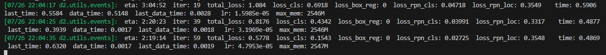

# **英才计划 7-8月月报**
tqz_ 2023/8/30
## **概要**
在这段时间内，我完成了以下内容：
- 阅读了三篇论文。
- 解决了项目的问题，将其基本完成，并制作了WebUI。
## **中期汇报**
完成了中期汇报 PPT 的大部分。
[PPT](https://github.com/tangqz/Machine-Learning-Monthly-Report/blob/main/%E8%8B%B1%E6%89%8D%E8%AE%A1%E5%88%92%20%E4%B8%AD%E6%9C%9F%E6%B1%87%E6%8A%A5-%E6%9C%AA%E5%AE%8C%E6%88%90.pptx)
## **阅读论文**
### SAM
**Segment Anything Model** 是一个用于图像分割的模型。它可以根据提示生成蒙版，从而将图像中的对象分割出来。SAM是一个预训练模型，可以在不同的图像分割任务上进行零样本迁移。 SAM 主要由三部分组成：  
 - **图像编码器：** 使用一个预训练的 Vision Transformer 来提取图像的特征向量。
 - **提示编码器：** 处理不同类型的提示，如点、框、文本或蒙版，将它们转换成与图像特征向量相容的向量。
 - **蒙版解码器：** 使用一个改进的 Transformer 解码器和一个动态线性分类器来根据图像特征向量和提示向量预测蒙版的前景概率。  

与较为传统的 R-CNN 不同，SAM 不再依赖于 CNN ，而是使用了类似 Transformer 的结构，由编码器和解码器构成。经过大量训练，SAM 具有较高的泛化性能。
### Llama 2
此论文介绍了 Llama 2 这一开源大型语言模型。其内容较为详细地介绍了该模型的预训练、微调以及安全性等内容。其中，我重点关注了论文中关于安全性这一部分的内容。  
训练大模型时，可以采取以下安全措施：

- **预训练阶段**： 选择公开的数据源进行预训练，对数据进行清洗和筛选，以减少有害或不可靠的内容。
- **微调阶段**： 对模型进行安全专用的微调，组织一支红队进行攻击测试，对模型进行人类评估和自动评估。
- **服务阶段**： 提供使用指南和代码示例，限制模型输出长度和交互次数，保持透明度和沟通。
###  Latent Diffusion Models
潜在扩散模型是一种基于概率的图像合成方法。概括来说，生成图片的过程便是根据输入的条件，对一张图片进行反复降噪去噪的过程。输入的条件可以是文本、图片等，最后都会被转换为向量来控制降噪过程。  
Stable Diffusion 是 LDM 的变种，目前已经被较为广泛地使用。  

## **项目进展**
解决了之前的问题，并基本完成了项目。
### 问题解决
检查日志时发现，训练过程中，`loss_box_reg`值始终为零。

经过排查和尝试，发现 Detectron2 要求标注的类别数目≥2。  
通过将标注数据 `train.json` 中的 `categories` 字段添加一条内容，该问题得以解决。  

### 训练集准备
使用 [Label Studio]([Title](https://github.com/heartexlabs/label-studio)) 对数据进行标注。
共标注了 24 张图片，包含 646 个蒙版。  

### 训练&预测代码实现
使用 Mask R-CNN 模型。  
共3个文件。  
[train.py](https://github.com/tangqz/bookcounter-finished/blob/main/train.py)  
[utils.py](https://github.com/tangqz/bookcounter-finished/blob/main/utils.py)  
[main.py](https://github.com/tangqz/bookcounter-finished/blob/main/main.py)  
在 `main.py` 中基于 `gradio` 项目，制作了 WebUI。
### 训练
以 24 张图片，646 个蒙版为训练集，学习率 0.0005 ，训练 20000 步。各 loss 曲线如图：  

### 预测
运行 `main.py` ，进行预测。效果如图：  
  
能通过局域网使用手机摄像头。在训练集中加入练习本堆，能准确识别练习本：  
  
不擅长识别倾斜的书本。  
为了进一步提升模型性能，可尝试对训练集做数据增强后重新训练。
